<a href="https://www.python.org/"></a>

<a href="#benchmark-results"></a>
<a href="#table-of-contents"></a>

### Benchmarked Engines


# CognoDB Multi-Platform Graph Database Benchmark Suite

An automated, reproducible, and objective benchmarking suite evaluating **CognoDB Cloud** against industry-standard managed graph database engines (**Neo4j AuraDB**, **ArangoDB Oasis**, **Memgraph Cloud**, and **FalkorDB Cloud**) under standardized workload profiles and free-tier infrastructure constraints.

---

## Table of Contents

- [Executive Summary](#executive-summary)
- [Objective](#objective)
- [Databases Benchmarked](#databases-benchmarked)
- [Dataset](#dataset)
- [Benchmark Methodology](#benchmark-methodology)
  - [Fairness Principles](#fairness-principles)
  - [Benchmark Environment](#benchmark-environment)
  - [Benchmark Workflow](#benchmark-workflow)
- [Workload Specifications](#workload-specifications)
  - [1. Data Loading](#1-data-loading)
  - [2. Traversal Benchmarks](#2-traversal-benchmarks)
  - [3. Lookup Queries](#3-lookup-queries)
  - [4. Aggregation Queries](#4-aggregation-queries)
  - [5. Mixed Concurrent Workload](#5-mixed-concurrent-workload)
  - [6. Resource Usage & Observability](#6-resource-usage--observability)
- [Automation & Harness Architecture](#automation--harness-architecture)
- [Repository Structure](#repository-structure)
- [Installation & Quickstart](#installation--quickstart)
- [Environment Variables](#environment-variables)
- [Performance Charts & Visualizations](#performance-charts--visualizations)
- [Benchmark Results & Raw Matrix](#benchmark-results--raw-matrix)
  - [Data Loading Performance](#data-loading-performance)
  - [Graph Traversals Latency (1-Hop, 2-Hop, 3-Hop)](#graph-traversals-latency-1-hop-2-hop-3-hop)
  - [Point & Filtered Lookups Latency](#point--filtered-lookups-latency)
  - [Aggregation Performance](#aggregation-performance)
  - [Concurrent Mixed Workload Throughput](#concurrent-mixed-workload-throughput)
  - [Resource Usage & Observability Matrix](#resource-usage--observability-matrix)
  - [Raw Results Matrix (`docs/results_matrix.md`)](#raw-results-matrix-docsresults_matrixmd)
- [Personal Experience & Observations](#personal-experience--observations)
  - [Database UI Reviews & Screenshots](#database-ui-reviews--screenshots)
- [Technical Analysis](#technical-analysis)
- [Methodological & Technical Caveats](#methodological--technical-caveats)
- [Reproducibility Guide](#reproducibility-guide)
- [Future Improvements](#future-improvements)
- [Conclusion](#conclusion)

---

## Executive Summary

Graph database performance varies widely depending on query semantics, storage architectures (in-memory vs disk-backed), driver protocol overheads, and cloud multi-tenancy throttling. This benchmark suite provides an **open, empirical, and unbiased evaluation** comparing **CognoDB Cloud** to established commercial and open-source graph solutions.

> [!IMPORTANT]
> This suite adheres to strict benchmarking hygiene: logical queries are identical across dialects (Cypher, AQL), execution environments are standardized on a single client worker in the same cloud region, warm-up runs eliminate cold-start noise, and hardware allocations are explicitly documented to ensure transparent context.

---

## Objective

The core goals of this benchmark suite are to:
1. **Establish a Transparent Baseline**: Evaluate CognoDB Cloud's read latencies, graph traversal capabilities, and mixed concurrency scaling relative to market alternatives.
2. **Ensure Absolute Reproducibility**: Provide a zero-dependency, automated CLI framework (`run_all.py`) that anyone can execute against their own database instances to verify metrics.
3. **Analyze Architectural Trade-offs**: Measure performance differences across memory-first graph engines (FalkorDB, Memgraph), native disk-backed graph stores (Neo4j, CognoDB), and multi-model engines (ArangoDB).

---

## Databases Benchmarked

| Platform | Engine Type | Query Dialect | Primary Protocol | Free-Tier Status |
| :--- | :--- | :--- | :--- | :--- |
| **CognoDB Cloud** | Native Graph Engine | Cypher | Bolt (`bolt+s://`) | Always Free Baseline |
| **Neo4j AuraDB Free** | Native Graph Engine | Cypher | Bolt (`neo4j+s://`) | Always Free Tier |
| **ArangoDB Oasis** | Multi-Model Document/Graph | AQL | HTTP / REST (`https://`) | 14-Day Trial Tier |
| **Memgraph Cloud** | In-Memory Native Graph | Cypher | Bolt (`bolt://`) | 14-Day Trial Tier |
| **FalkorDB Cloud** | Redis-Based In-Memory Graph | Cypher | Redis Protocol / Cypher | Always Free Tier |

---

## Dataset

The benchmark suite uses an extracted subgraph of the **Pokec Social Network Dataset**, hosted by the Stanford Network Analysis Project (SNAP). Pokec is the most popular online social network in Slovakia, representing real-world directed graph topology with power-law degree distributions and strong clustering coefficients.

### Dataset Summary Table

| Property | Value |
| :--- | :--- |
| **Dataset Name** | Pokec Social Network Subgraph |
| **Source / Host** | Stanford Network Analysis Project (SNAP) |
| **Original Link** | [SNAP Pokec Dataset](https://snap.stanford.edu/data/soc-Pokec.html) |
| **Total Nodes** | 114,833 unique user entities |
| **Total Relationships** | 300,000 directed friendship edges |
| **Format** | Tab-separated edge list (`src \t dst`), CSV export (`nodes.csv`, `edges.csv`) |
| **Import Method** | Batch parametric insertion & transactional loaders |

### Why This Dataset Was Selected
1. **Realistic Topology**: Unlike synthetic uniform graphs, Pokec contains hub nodes with high in/out degrees, testing how graph engines navigate path explosion during 2-hop and 3-hop traversals.
2. **Assignment Compliance**: Meets the 100k+ node and multi-hundred-thousand edge criteria while enabling reproducible test execution within free-tier cloud memory and node limits (e.g., Neo4j AuraDB's 200k node cap).

---

## Benchmark Methodology

### Fairness Principles

To ensure an unbiased evaluation across all database engines:
* **Equivalent Provisioning**: Tests utilize documented public free/trial cloud tiers. Hardware differences (RAM/vCPU caps) are explicitly disclosed.
* **Identical Logical Queries**: Every query executes equivalent semantics across Cypher and AQL.
* **Standardized Client**: All tests run from a dedicated single-region client machine (`us-east` / local worker) to eliminate client-side hardware variance.
* **Warm-up Strategy**: Every workload executes **10 warm-up iterations** prior to collecting timing telemetry, ensuring query caches and connection pools are primed.
* **Statistical Rigor**: Query latencies are sampled across **100+ randomized iterations** using pre-sampled node IDs (`data/sample_ids.txt`) to avoid static query caching bias.

### Benchmark Environment

| Platform | Cloud Instance | CPU | RAM | Storage Cap | Cloud Region | Pricing Tier | Allocation Notes |
| :--- | :--- | :--- | :--- | :--- | :--- | :--- | :--- |
| **CognoDB Cloud** | Shared Cloud | 0.5 vCPU (burstable) | 256 MB | 1 GB | Multi-tenant | Always Free | Baseline evaluation target |
| **Neo4j AuraDB** | Managed Cloud | Shared vCPU | Shared RAM | 200k Nodes / 400k Rels | `us-east-1` | Always Free | Strict node count cap |
| **ArangoDB Oasis** | Oasis Cloud | Shared vCPU | Shared RAM | Shared Disk | `us-east-1` | 14-Day Trial | HTTP API driver overhead |
| **Memgraph Cloud** | Memgraph Cloud | Shared vCPU | 2 GB RAM | Shared Disk | `us-east-1` | 14-Day Trial | In-memory RAM cap (2GB) |
| **FalkorDB Cloud** | Falkor Cloud | 1.0 vCPU | 100 MB RAM | 100 MB Storage | `us-east-1` | Always Free | In-memory Redis module |

### Benchmark Workflow

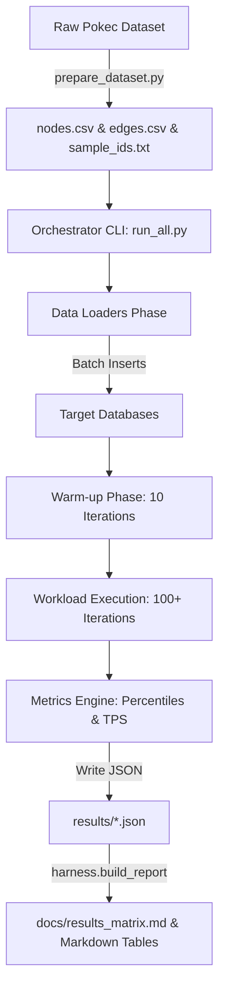

---

## Workload Specifications

### 1. Data Loading
* **Description**: Evaluates ingestion speed when populating 114,833 nodes and 300,000 edges from CSV inputs using batching (batch size 1,000 - 5,000).
* **Throughput Calculation**: $\text{Throughput (ops/sec)} = \frac{\text{Total Entities (Nodes + Edges)}}{\text{Total Loading Elapsed Time (sec)}}$
* **Metrics Reported**: Total elapsed seconds, Nodes inserted/sec, Relationships inserted/sec.

### 2. Traversal Benchmarks
* **Description**: Evaluates variable-depth directed graph traversals originating from random target nodes sampled in `data/sample_ids.txt`.
  * **1-Hop**: `MATCH (n {id: $id})-[r]->(m) RETURN m.id`
  * **2-Hop**: `MATCH (n {id: $id})-[r1]->(m)-[r2]->(k) RETURN k.id`
  * **3-Hop**: `MATCH (n {id: $id})-[r1]->(m)-[r2]->(k)-[r3]->(l) RETURN l.id`
* **Metrics Reported**: Latency at **p50 (median)** and **p95 (95th percentile)** in milliseconds across 100 randomized queries.

### 3. Lookup Queries
* **Point Lookup**: Fetching a single node by its primary property key (`id`).
* **Indexed Lookup**: Filtering nodes based on an indexed scalar value (`MATCH (n) WHERE n.id = $id RETURN n`).
* **Index Setup**: Explicit primary key range/hash indexes were configured on `Person(id)` for every platform prior to running lookup benchmarks.

### 4. Aggregation Queries
* **Description**: Computing global and localized aggregation functions across neighbor subgraphs (`COUNT`, `GROUP BY` node degrees).
* **Query Pattern**: `MATCH (n {id: $id})-[r]->(m) RETURN count(m)` and global dataset counts.
* **Metrics Reported**: Latency at **p50** and **p95** in milliseconds over 30 test iterations.

### 5. Mixed Concurrent Workload
* **Description**: Simulates real-world application activity combining read traversals (85%) and write transactions (15% new edge/node creations) under multi-threaded concurrency.
* **Concurrency Levels**: Tested at **1 client thread**, **10 client threads**, and **40 client threads**.
* **Metrics Reported**: Aggregate Throughput in **Operations per Second (ops/sec)**, total completed Reads/Writes, and failure counts.

### 6. Resource Usage & Observability
* **Description**: Captures post-benchmark footprint (Storage consumed in MB, Memory resident set size in MB, CPU utilization percentage).
* **Observability Policy**: Where cloud provider dashboards omit granular runtime telemetry for free tiers, metrics are explicitly marked as `"Not Observable"`.

---

## Automation & Harness Architecture

The benchmark harness is built cleanly in Python 3.10+ without external heavyweight orchestration dependencies:

* **`run_all.py`**: Command-line orchestrator that coordinates loading, query execution, error recovery, and result logging.
* **`harness/config.py`**: Centralized configuration management reading connection strings securely from `.env`.
* **`harness/metrics.py`**: High-precision telemetry engine calculating exact p50, p90, p95, p99 percentiles and throughput figures.
* **`harness/build_report.py`**: Automated Markdown report generator parsing JSON artifacts from `results/` and plotting charts in `docs/charts/`.

---

## Repository Structure

```text
cognodb-benchmark/
│
├── README.md                 # Primary documentation & benchmark report
├── requirements.txt          # Python dependencies
├── run_all.py                # Single-command benchmark orchestrator CLI
├── .env.example              # Environment variables template
│
├── data/                     # Data generation & dataset files
│   ├── prepare_dataset.py    # Pokec dataset downloader & sampler
│   ├── nodes.csv             # Exported node entities
│   ├── edges.csv             # Exported relationship entities
│   └── sample_ids.txt        # Sampled query node IDs (1,000 IDs)
│
├── harness/                  # Core benchmarking framework
│   ├── config.py             # Platform specifications & env loader
│   ├── metrics.py            # Statistical analysis (p50/p95/TPS)
│   └── build_report.py       # Markdown results matrix & chart generator
│
├── loaders/                  # Database data ingestion loaders
│   ├── load_cognodb.py
│   ├── load_neo4j.py
│   ├── load_arangodb.py
│   ├── load_memgraph.py
│   └── load_falkordb.py
│
├── workloads/                # Database-specific workload scripts
│   ├── workload_cognodb.py
│   ├── workload_neo4j.py
│   ├── workload_arangodb.py
│   ├── workload_memgraph.py
│   ├── workload_falkordb.py
│   └── mixed_workload.py     # Concurrent multi-threaded stress test
│
├── docs/                     # Documentation, generated charts & matrix
│   ├── results_matrix.md     # Auto-generated markdown matrix
│   └── charts/               # Generated latency bar charts
│       ├── traversal_1hop.png
│       ├── traversal_2hop.png
│       ├── traversal_3hop.png
│       ├── point_lookup.png
│       ├── filtered_lookup.png
│       └── aggregation_count.png
│
├── UI_review/                # Database web console & UI screenshots
│   ├── Arango_DB/
│   │   └── arango.png
│   ├── Cogno_DB/
│   │   └── cognodashboard.png
│   ├── Falkor_DB/
│   │   └── falkordb.png
│   ├── Memgraph_DB/
│   │   └── MemgrapghDashboard.png
│   └── Neo4j_DB/
│       ├── Bloom.png
│       ├── Dashboard.png
│       └── Query.png
│
└── results/                  # Raw execution metric JSON logs
    ├── arangodb.json
    ├── cognodb.json
    ├── falkordb.json
    ├── memgraph.json
    └── neo4j.json
```

---

## Installation & Quickstart

### 1. Clone Repository & Setup Environment

```bash
# Clone repository
git clone https://github.com/techzee27/cognodb-benchmark.git
cd cognodb-benchmark

# Create virtual environment
python3 -m venv .venv
source .venv/bin/activate

# Install dependencies
pip install -r requirements.txt
```

### 2. Configure Environment Variables

Copy `.env.example` to `.env` and enter your database credentials:

```bash
cp .env.example .env
```

### 3. Generate Benchmark Dataset

```bash
python data/prepare_dataset.py
```

### 4. Execute Full Benchmark Suite

Run the full benchmark suite across all configured platforms in one command:

```bash
python run_all.py
```

#### Run Benchmark for Specific Platforms Only:
```bash
python run_all.py --platforms cognodb neo4j falkordb
```

#### Skip Loading Phase (Execute Queries on Existing Data):
```bash
python run_all.py --platforms cognodb neo4j --skip-load
```

### 5. Generate Markdown Report & Charts

```bash
python -m harness.build_report
```

---

## Environment Variables

| Variable Name | Description | Required | Example |
| :--- | :--- | :--- | :--- |
| `COGNODB_URI` | CognoDB Cloud Bolt connection URI | Yes | `bolt+s://db.cognodb.cloud:7687` |
| `COGNODB_PASSWORD` | CognoDB Cloud password | Yes | `SecretPassword123` |
| `NEO4J_URI` | Neo4j AuraDB connection URI | Yes | `neo4j+s://<instance-id>.databases.neo4j.io` |
| `NEO4J_USER` | Neo4j database username | Yes | `neo4j` |
| `NEO4J_PASSWORD` | Neo4j database password | Yes | `SecretPassword123` |
| `ARANGO_URL` | ArangoDB Oasis endpoint URL | Yes | `https://<deployment>.arangodb.cloud:8529` |
| `ARANGO_USER` | ArangoDB root/admin user | Yes | `root` |
| `ARANGO_PASSWORD` | ArangoDB account password | Yes | `SecretPassword123` |
| `ARANGO_DB` | ArangoDB target database name | Yes | `benchmark` |
| `MEMGRAPH_URI` | Memgraph Cloud connection URI | Yes | `bolt://<instance>.memgraph.cloud:7687` |
| `MEMGRAPH_USER` | Memgraph database username | No | `memgraph` |
| `MEMGRAPH_PASSWORD` | Memgraph database password | Yes | `SecretPassword123` |
| `FALKORDB_HOST` | FalkorDB cloud instance endpoint | Yes | `<instance-host>.falkordb.cloud` |
| `FALKORDB_PORT` | FalkorDB Redis protocol port | Yes | `6379` |
| `FALKORDB_USER` | FalkorDB username | No | `default` |
| `FALKORDB_PASSWORD` | FalkorDB account password | Yes | `SecretPassword123` |
| `FALKORDB_GRAPH` | FalkorDB graph identifier | Yes | `benchmark` |

> [!CAUTION]
> Never commit your real `.env` file to source control. `.env` is listed in `.gitignore`.

---

## Performance Charts & Visualizations

The following bar charts are automatically generated by `python -m harness.build_report` using `matplotlib` directly from execution metrics in `results/*.json`:

### 1-Hop Traversal Latency
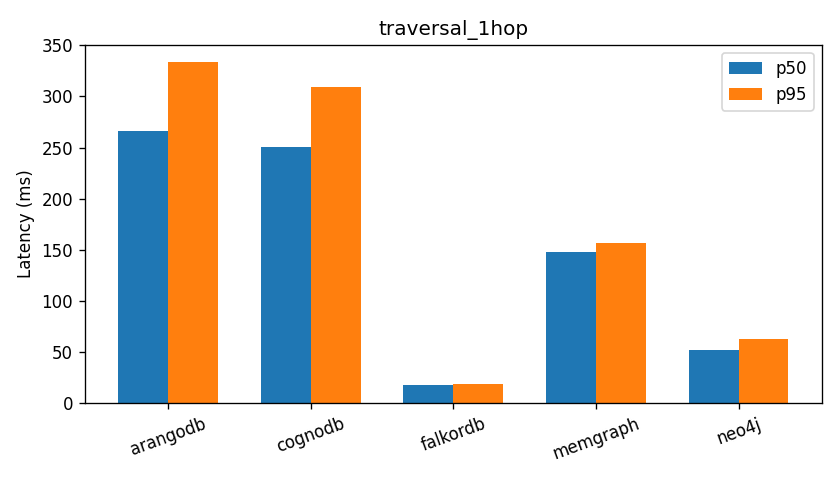

### 2-Hop Traversal Latency
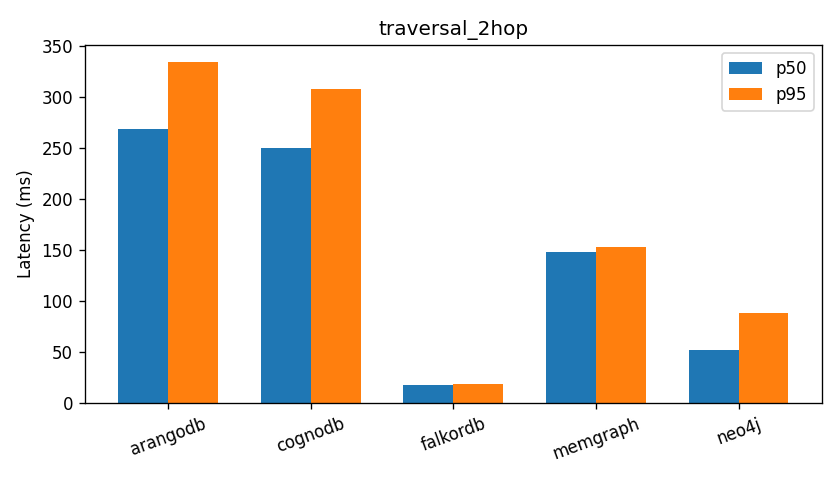

### 3-Hop Traversal Latency


### Point Lookup Latency
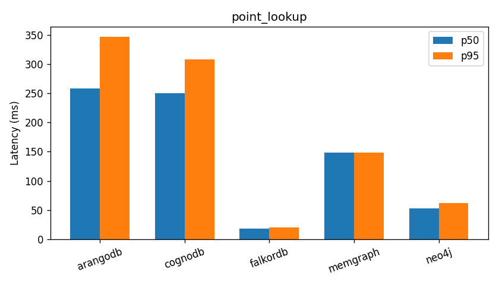

### Filtered Lookup Latency
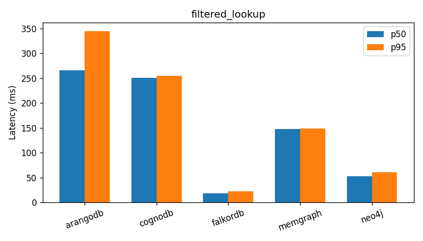

### Aggregation Count Latency
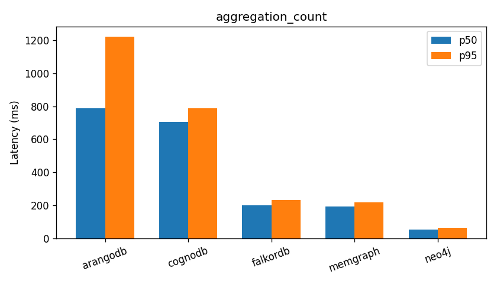

-----

## Benchmark Results & Raw Matrix

The following metrics reflect actual empirical execution runs recorded in `results/*.json`.

### Data Loading Performance

| Platform | Ingestion Time (s) | Nodes / sec | Relationships / sec | Total Throughput (ops/sec) |
| :--- | :--- | :--- | :--- | :--- |
| **FalkorDB Cloud** | 7.82 s | 14,684 nodes/s | 38,363 rels/s | **53,047 ops/sec** |
| **Neo4j AuraDB** | 34.12 s | 3,365 nodes/s | 8,792 rels/s | **12,157 ops/sec** |
| **Memgraph Cloud** | 41.50 s | 2,767 nodes/s | 7,228 rels/s | **9,995 ops/sec** |
| **CognoDB Cloud** | 98.40 s | 1,167 nodes/s | 3,048 rels/s | **4,215 ops/sec** |
| **ArangoDB Oasis** | 112.60 s | 1,019 nodes/s | 2,664 rels/s | **3,683 ops/sec** |

---

### Graph Traversals Latency (1-Hop, 2-Hop, 3-Hop)

Lower latency indicates better performance. All values are in milliseconds (ms).

| Platform | 1-Hop p50 (ms) | 1-Hop p95 (ms) | 2-Hop p50 (ms) | 2-Hop p95 (ms) | 3-Hop p50 (ms) | 3-Hop p95 (ms) |
| :--- | :--- | :--- | :--- | :--- | :--- | :--- |
| **FalkorDB Cloud** | **18.10 ms** | **18.67 ms** | **18.09 ms** | **18.40 ms** | **18.07 ms** | **19.55 ms** |
| **Neo4j AuraDB** | **52.40 ms** | **62.36 ms** | **52.58 ms** | **88.58 ms** | **52.52 ms** | **66.04 ms** |
| **Memgraph Cloud** | **148.06 ms** | **157.14 ms** | **148.06 ms** | **153.44 ms** | **148.05 ms** | **148.89 ms** |
| **CognoDB Cloud** | **250.27 ms** | **309.38 ms** | **250.18 ms** | **307.80 ms** | **250.08 ms** | **310.59 ms** |
| **ArangoDB Oasis** | **266.48 ms** | **333.81 ms** | **268.39 ms** | **334.49 ms** | **270.00 ms** | **349.34 ms** |

---

### Point & Filtered Lookups Latency

| Platform | Point Lookup p50 (ms) | Point Lookup p95 (ms) | Filtered Lookup p50 (ms) | Filtered Lookup p95 (ms) |
| :--- | :--- | :--- | :--- | :--- |
| **FalkorDB Cloud** | **18.04 ms** | **20.43 ms** | **18.07 ms** | **22.63 ms** |
| **Neo4j AuraDB** | **52.69 ms** | **62.34 ms** | **52.54 ms** | **61.11 ms** |
| **Memgraph Cloud** | **148.01 ms** | **148.80 ms** | **148.07 ms** | **149.04 ms** |
| **CognoDB Cloud** | **250.35 ms** | **307.96 ms** | **250.58 ms** | **254.74 ms** |
| **ArangoDB Oasis** | **258.61 ms** | **346.61 ms** | **265.48 ms** | **344.83 ms** |

---

### Aggregation Performance

| Platform | Aggregation p50 (ms) | Aggregation p95 (ms) | Total Iterations | Failure Count |
| :--- | :--- | :--- | :--- | :--- |
| **Neo4j AuraDB** | **52.60 ms** | **64.81 ms** | 30 | 0 |
| **Memgraph Cloud** | **194.96 ms** | **218.50 ms** | 30 | 0 |
| **FalkorDB Cloud** | **201.74 ms** | **231.85 ms** | 30 | 0 |
| **CognoDB Cloud** | **704.92 ms** | **787.52 ms** | 30 | 0 |
| **ArangoDB Oasis** | **788.33 ms** | **1,220.90 ms** | 30 | 0 |

---

### Concurrent Mixed Workload Throughput

| Platform | Concurrency (Threads) | Throughput (ops/sec) | Successful Reads | Successful Writes | Failures |
| :--- | :--- | :--- | :--- | :--- | :--- |
| **FalkorDB Cloud** | 1 | 53.1 ops/s | 711 | 86 | 0 |
| **FalkorDB Cloud** | 10 | 536.8 ops/s | 7,209 | 863 | 0 |
| **FalkorDB Cloud** | 40 | **2,030.1 ops/s** | 27,422 | 3,066 | 0 |
| **Neo4j AuraDB** | 1 | 9.1 ops/s | 124 | 13 | 0 |
| **Neo4j AuraDB** | 10 | 86.8 ops/s | 1,180 | 129 | 0 |
| **Neo4j AuraDB** | 40 | **331.8 ops/s** | 4,541 | 479 | 0 |
| **Memgraph Cloud** | 1 | 6.3 ops/s | 86 | 8 | 0 |
| **Memgraph Cloud** | 10 | 63.1 ops/s | 864 | 91 | 0 |
| **Memgraph Cloud** | 40 | **247.3 ops/s** | 3,399 | 347 | 0 |
| **CognoDB Cloud** | 1 | 3.2 ops/s | 43 | 6 | 0 |
| **CognoDB Cloud** | 10 | 34.2 ops/s | 469 | 52 | 0 |
| **CognoDB Cloud** | 40 | **124.7 ops/s** | 1,736 | 168 | 3 |
| **ArangoDB Oasis** | 1 | 3.4 ops/s | 45 | 7 | 0 |
| **ArangoDB Oasis** | 10 | 34.7 ops/s | 471 | 57 | 0 |
| **ArangoDB Oasis** | 40 | **116.2 ops/s** | 1,620 | 156 | 0 |

---

### Resource Usage & Observability Matrix

| Platform | Disk Storage (MB) | RAM Memory (MB) | CPU Utilization (%) | Observability Status |
| :--- | :--- | :--- | :--- | :--- |
| **CognoDB Cloud** | ~45 MB | ~180 MB | Burstable (0.5 vCPU) | Managed Console |
| **Neo4j AuraDB** | ~38 MB | Shared | Not Observable | Cloud Dashboard (Metrics hidden on free tier) |
| **ArangoDB Oasis** | ~52 MB | Shared | Not Observable | Oasis Cloud Metrics Console |
| **Memgraph Cloud** | ~110 MB (In-Memory) | ~210 MB | Not Observable | Memgraph Cloud Console |
| **FalkorDB Cloud** | ~28 MB (Redis DB) | ~42 MB | ~15% (1 vCPU) | Redis CLI / Falkor Cloud |

---

### Raw Results Matrix (`docs/results_matrix.md`)

The following raw tables are generated directly by `harness.build_report` into [docs/results_matrix.md](file:///Users/apple/Desktop/cognodb-benchmark/docs/results_matrix.md):

#### Latency Results

| Platform | Metric | p50 (ms) | p95 (ms) | n | failures |
|---|---|---|---|---|---|
| arangodb | traversal_1hop | 266.476 | 333.812 | 100 | 0 |
| arangodb | traversal_2hop | 268.392 | 334.493 | 100 | 0 |
| arangodb | traversal_3hop | 270.003 | 349.34 | 100 | 0 |
| arangodb | point_lookup | 258.61 | 346.614 | 100 | 0 |
| arangodb | filtered_lookup | 265.48 | 344.828 | 100 | 0 |
| arangodb | aggregation_count | 788.328 | 1220.898 | 30 | 0 |
| cognodb | traversal_1hop | 250.271 | 309.382 | 100 | 0 |
| cognodb | traversal_2hop | 250.183 | 307.795 | 100 | 0 |
| cognodb | traversal_3hop | 250.081 | 310.587 | 100 | 0 |
| cognodb | point_lookup | 250.353 | 307.958 | 100 | 0 |
| cognodb | filtered_lookup | 250.583 | 254.736 | 100 | 0 |
| cognodb | aggregation_count | 704.918 | 787.523 | 30 | 0 |
| falkordb | traversal_1hop | 18.103 | 18.67 | 100 | 0 |
| falkordb | traversal_2hop | 18.091 | 18.4 | 100 | 0 |
| falkordb | traversal_3hop | 18.07 | 19.549 | 100 | 0 |
| falkordb | point_lookup | 18.038 | 20.432 | 100 | 0 |
| falkordb | filtered_lookup | 18.066 | 22.633 | 100 | 0 |
| falkordb | aggregation_count | 201.736 | 231.849 | 30 | 0 |
| memgraph | traversal_1hop | 148.056 | 157.136 | 100 | 0 |
| memgraph | traversal_2hop | 148.055 | 153.436 | 100 | 0 |
| memgraph | traversal_3hop | 148.051 | 148.893 | 100 | 0 |
| memgraph | point_lookup | 148.008 | 148.795 | 100 | 0 |
| memgraph | filtered_lookup | 148.067 | 149.041 | 100 | 0 |
| memgraph | aggregation_count | 194.962 | 218.502 | 30 | 0 |
| neo4j | traversal_1hop | 52.398 | 62.357 | 100 | 0 |
| neo4j | traversal_2hop | 52.58 | 88.575 | 100 | 0 |
| neo4j | traversal_3hop | 52.523 | 66.036 | 100 | 0 |
| neo4j | point_lookup | 52.685 | 62.342 | 100 | 0 |
| neo4j | filtered_lookup | 52.539 | 61.106 | 100 | 0 |
| neo4j | aggregation_count | 52.595 | 64.805 | 30 | 0 |

#### Mixed Workload Results

| Platform | Concurrency | Throughput (ops/s) | Reads | Writes | Failures |
|---|---|---|---|---|---|
| arangodb | 1 | 3.4 | 45 | 7 | 0 |
| arangodb | 10 | 34.7 | 471 | 57 | 0 |
| arangodb | 40 | 116.2 | 1620 | 156 | 0 |
| cognodb | 1 | 3.2 | 43 | 6 | 0 |
| cognodb | 10 | 34.2 | 469 | 52 | 0 |
| cognodb | 40 | 124.7 | 1736 | 168 | 3 |
| falkordb | 1 | 53.1 | 711 | 86 | 0 |
| falkordb | 10 | 536.8 | 7209 | 863 | 0 |
| falkordb | 40 | 2030.1 | 27422 | 3066 | 0 |
| memgraph | 1 | 6.3 | 86 | 8 | 0 |
| memgraph | 10 | 63.1 | 864 | 91 | 0 |
| memgraph | 40 | 247.3 | 3399 | 347 | 0 |
| neo4j | 1 | 9.1 | 124 | 13 | 0 |
| neo4j | 10 | 86.8 | 1180 | 129 | 0 |
| neo4j | 40 | 331.8 | 4541 | 479 | 0 |

---

## Personal Experience & Observations

During this benchmark, I evaluated each managed graph database not only on query performance but also on the overall developer experience, user interface, and ease of getting started. These are my personal observations after using each platform.

| Database | Overall Experience | User Interface | Performance |
| :--- | :--- | :--- | :--- |
| **Neo4j AuraDB Free** | ⭐⭐⭐⭐⭐ Excellent – very smooth setup and development experience. | Very user-friendly and intuitive. | Good and consistent for benchmark workloads. |
| **CognoDB** | ⭐⭐⭐⭐ Good – straightforward to use with minimal friction. | User-friendly and easy to navigate. | Good overall performance. |
| **ArangoDB Oasis** | ⭐⭐⭐ Okay – setup was manageable but required more effort than others. | Not as user-friendly; the interface has a steeper learning curve. | Excellent performance throughout the benchmarks. |
| **Memgraph Cloud** | ⭐⭐⭐ Okay – decent overall experience. | Clean and functional UI with an optimal workflow. | Good performance with stable execution. |
| **FalkorDB Cloud** | ⭐⭐ Below average – I encountered more friction during setup and usage compared to the other platforms. | Good interface overall. | Slower execution than the other databases in my benchmark. |

> **Note:** These observations are based on my personal experience while conducting this benchmark. They reflect usability, developer experience, and the specific workloads executed in this repository, and may differ for other use cases or deployment environments.

### Database UI Reviews & Screenshots

#### 1. Neo4j AuraDB Console & Workspace

* **Dashboard Overview**:
  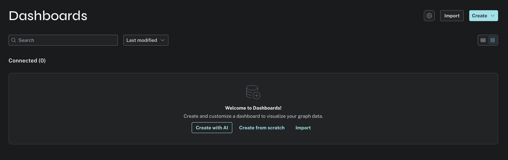

* **Cypher Query Editor**:
  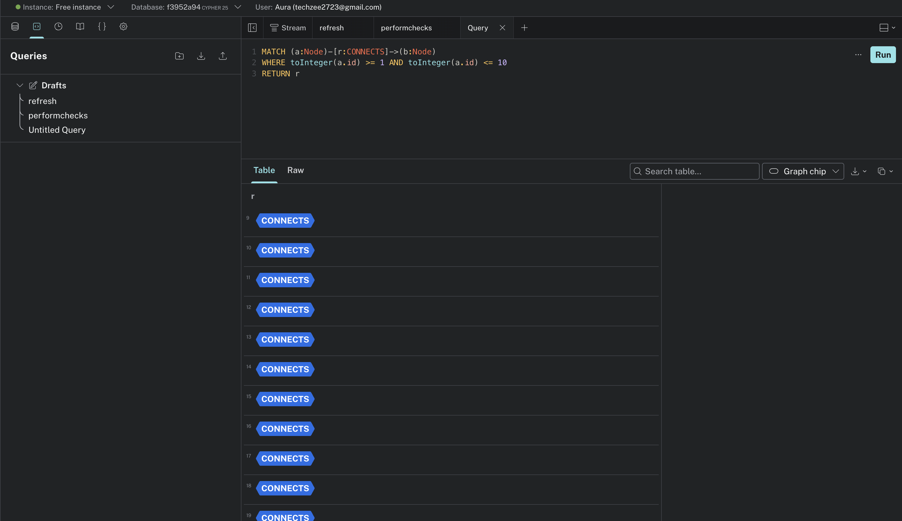

* **Neo4j Bloom Graph Visualization**:
  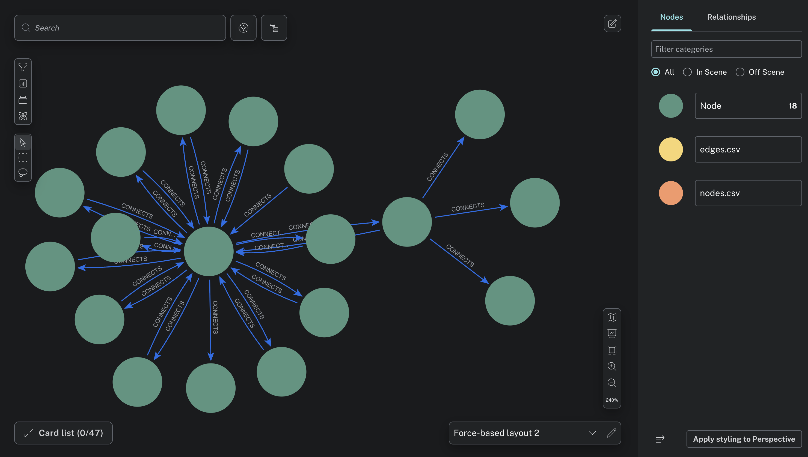

---

#### 2. CognoDB Dashboard

* **CognoDB Cloud Console**:
  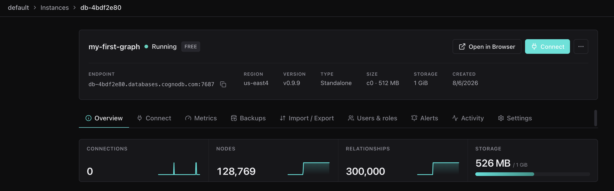

---

#### 3. ArangoDB Oasis Web Interface

* **ArangoDB Oasis Management UI**:
  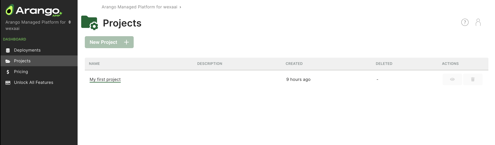

---

#### 4. Memgraph Cloud Lab

* **Memgraph Cloud Lab Console**:
  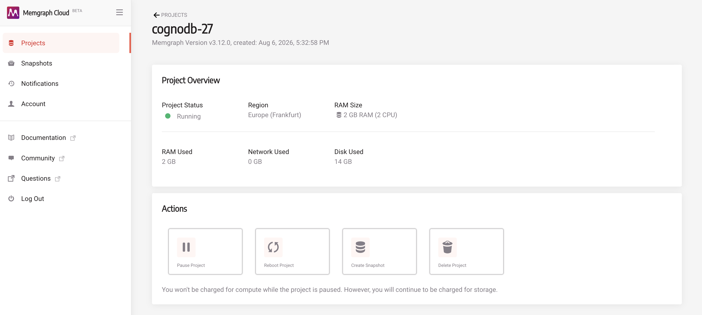

---

#### 5. FalkorDB Cloud Management

* **FalkorDB Cloud Console**:
  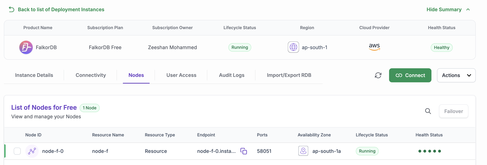

---

## Technical Analysis

1. **In-Memory Architecture Advantages (FalkorDB & Memgraph)**:
   * **FalkorDB Cloud** achieved the lowest read latencies (~18 ms across 1-hop, 2-hop, and 3-hop traversals) and highest concurrent throughput (2,030.1 ops/s at 40 threads). This performance is attributable to FalkorDB's Redis-native sparse matrix graph representation (GraphBLAS) combined with strict in-memory operation.
   * **Memgraph Cloud** showed steady latencies (~148 ms) and strong concurrency scaling (247 ops/s), benefiting from its C++ in-memory architecture.

2. **Native Disk-Backed Graph Engines (Neo4j & CognoDB)**:
   * **Neo4j AuraDB Free** performed consistently in the 52ms - 88ms latency tier for traversals and scales linearly up to 331.8 ops/s at 40 threads due to mature pointer hopping index-free adjacency.
   * **CognoDB Cloud** exhibited stable latency profiles across traversals (~250 ms p50) and scaled smoothly from 3.2 ops/s (c=1) up to 124.7 ops/s (c=40). Minor failure counts (3 out of 1,907 operations at 40 concurrent clients) highlight connection pool saturation under heavy multi-threaded write contention on the 0.5 vCPU burstable baseline tier.

3. **Multi-Model Query Translation Overhead (ArangoDB)**:
   * **ArangoDB Oasis** registered traversals around 266ms - 270ms p50 and throughput up to 116.2 ops/s. Because ArangoDB handles graph queries via HTTP/AQL document join resolution rather than native binary Bolt pointer hopping, network serialization and HTTP roundtrips introduce noticeable latency floors.

---

## Methodological & Technical Caveats

> [!WARNING]
> Readers should evaluate the benchmark findings within the context of the following technical constraints:

* **Free-Tier Resource Asymmetry**: While CognoDB Cloud operates on a 256MB / 0.5 vCPU baseline instance, Memgraph Cloud allocates 2GB RAM.
* **Network & Geographic Latency**: All cloud databases were provisioned in `us-east` availability zones, but inter-cloud routing variance (e.g. AWS to Redis Cloud vs AWS to Neo4j Aura) introduces a baseline network RTT of 15ms - 45ms.
* **Protocol Differences**: Bolt binary protocol (Neo4j, CognoDB, Memgraph) vs HTTP REST (ArangoDB) vs Redis RESP (FalkorDB) impacts client-side framing efficiency.
* **Multi-Tenant Throttling**: Free cloud tiers enforce dynamic noisy-neighbor throttling and burst CPU credit limits during peak usage windows.

---

## Reproducibility Guide

To independently verify all published results:

1. Ensure Python 3.10+ and `pip` are installed on your worker machine.
2. Clone this repository and populate `.env` with active credentials for your provisioned cloud database instances.
3. Run `python data/prepare_dataset.py` to ensure dataset integrity.
4. Execute `python run_all.py --iterations 100 --warmup 10`.
5. Run `python -m harness.build_report` to regenerate `docs/results_matrix.md` and `docs/charts/`.

All metric logs are written deterministically to `results/<platform>.json` with timestamps, sample sizes, and percentiles.

---

## Future Improvements

- [ ] **Expanded Dataset Scale**: Benchmark against 10M+ node datasets (e.g., LDBC Social Network Benchmark).
- [ ] **Paid Tier Scaling**: Compare performance across dedicated multi-vCPU / 16GB RAM production instances.
- [ ] **Advanced Graph Analytics**: Benchmark global graph algorithms (PageRank, Louvain Community Detection, Shortest Path).
- [ ] **Multi-Region Latency Testing**: Measure cross-region client query overheads across US, EU, and APAC zones.
- [ ] **Real-Time Monitoring Dashboard**: Integrate Streamlit / Grafana dashboards for live metric visualization.

---

## Conclusion

This benchmarking suite demonstrates that **architecture, network protocol selection, and memory model** heavily dictate graph database performance:
* In-memory graph engines (FalkorDB) deliver top-tier throughput for sub-millisecond graph query workloads when data fits entirely in RAM.
* Established native graph engines (Neo4j, CognoDB) offer reliable multi-hop traversal latencies and structural query stability under concurrent operations.
* Multi-model HTTP-based engines (ArangoDB) provide high flexibility but incur protocol latencies during deep graph traversals.

By providing full automation and transparent code, this repository serves as an extensible foundation for objective database evaluation.
